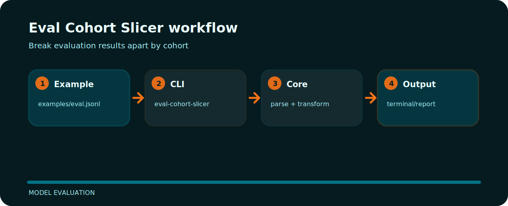

# Eval Cohort Slicer


## Working map



## Command line

```bash
git clone https://github.com/mertefekurt/eval-cohort-slicer.git
cd eval-cohort-slicer
python -m pip install -e ".[dev]"
eval-cohort-slicer examples/eval.jsonl --by language
eval-cohort-slicer examples/eval.jsonl --by language --json
```

## Useful details

Eval Cohort Slicer focuses on one practical job in model evaluation. The README below is arranged around the shortest path from clone to result.

| Detail | Value |
| --- | --- |
| Area | model evaluation |
| Entry | `eval-cohort-slicer` |
| Input | JSONL records |
| Output | readable terminal output |
