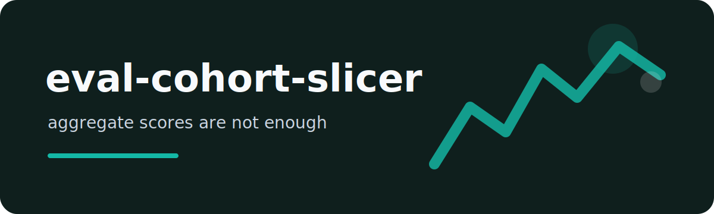

# eval-cohort-slicer

A model eval can look healthy in aggregate while failing one customer segment, language, policy area, or data
source. `eval-cohort-slicer` groups JSONL eval rows by a metadata field and ranks the weakest cohorts.

## Minimal case

```json
{"id":"case-1","score":0.92,"passed":true,"metadata":{"language":"en","channel":"chat"}}
```

```bash
eval-cohort-slicer examples/eval.jsonl --by language
eval-cohort-slicer examples/eval.jsonl --by channel --min-cases 10 --json
```

## Reading the report

The CLI prints one line per cohort with case count, pass rate, and average score. It exits successfully even
when a cohort is weak; the purpose is diagnosis, not CI gating.

## Good fit

- LLM answer grading datasets
- RAG eval results with source metadata
- support automation tests split by language or ticket type
- regression checks before prompt or model routing changes

## Test command

```bash
ruff check . && pytest
```

MIT license.
